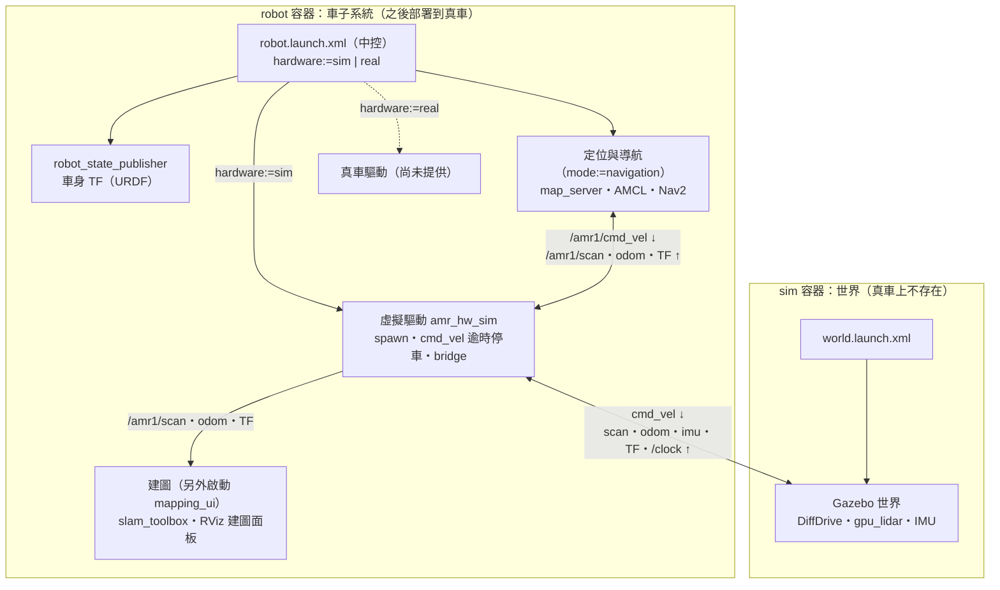

# AMR SLAM 模擬

ROS 2 Humble + Gazebo Fortress 的倉庫 AMR 模擬環境：可編輯的倉庫場景、一台帶 2D 光達與 IMU 的差速車，世界與車子系統分開執行——車子系統以「硬體模式」切換虛擬（Gazebo）或真實驅動，建圖、導航、之後的派車都建立在同一套車子系統上。

- 子專案 1：模擬環境（完成）。設計與任務紀錄見 [`openspec/changes/archive/2026-10-08-add-sim-environment/`](openspec/changes/archive/2026-10-08-add-sim-environment/)。
- 子專案 2：建圖、定位、導航（完成）。設計與任務紀錄見 [`openspec/changes/archive/2026-10-08-add-navigation/`](openspec/changes/archive/2026-10-08-add-navigation/)。

規格見 [`openspec/specs/`](openspec/specs/)，逐步學習筆記見 [`docs/學習筆記/`](docs/學習筆記/README.md)。

## 架構



| 套件 | 內容 | 真車需要 |
|---|---|---|
| `amr_worlds` | 場景產生器、world、`world.launch.xml` | ❌ |
| `amr_description` | 車輛模型（xacro → URDF） | ✅ |
| `amr_bringup` | 車子系統中控 `robot.launch.xml` | ✅ |
| `amr_hw_sim` | 虛擬驅動 `sim_hardware.launch.xml`、冒煙測試 | ❌ |
| `amr_navigation` | 建圖 `mapping.launch.xml`（含存圖服務）、導航 `navigation.launch.xml`、標地圖原點服務、參數、導航用 RViz 設定 | ✅ |
| `amr_interfaces` | 自訂 ROS 介面（`SetMapOrigin.srv`） | ✅ |
| `amr_rviz_plugins` | RViz「AMR 建圖」「AMR 地圖原點」面板、「設定原點」工具、`mapping_ui`／`map_origin_ui` launch | 操作員電腦 |

## 準備

### 主機

Ubuntu 22.04，docker：

1. [docker 群組](docs/學習筆記/01-docker群組.md)：`sudo usermod -aG docker $USER` 後重新登入
2. [NVIDIA 驅動](docs/學習筆記/02-NVIDIA驅動.md)：`nvidia-smi` 看得到 GPU
3. [NVIDIA Container Toolkit](docs/學習筆記/03-NVIDIA-Container-Toolkit.md)：`docker run --rm --gpus all ubuntu nvidia-smi` 成功

沒有 NVIDIA GPU 時可以跳過 2、3，改用 `cpu` 模式（軟體渲染）。

### 建置映像、啟動容器

```bash
docker/amr_sim/build.sh          # 建置映像（自動帶入你的 UID/GID）
docker/amr_sim/up.sh gpu all     # 背景啟動 sim、robot 兩個長駐容器（不會開任何視窗）
```

- `up.sh <gpu|cpu> <sim|robot|all> [compose 參數]`：兩個參數都必填；`cpu` 用軟體渲染；`sim`／`robot` 只啟動或重建那一個容器。修改 Dockerfile 後加 `--build`。
- 進入容器：`docker/amr_sim/exec.sh sim`（世界）或 `docker/amr_sim/exec.sh robot`（車子系統），必須指定。以下每一步都註明在哪個容器執行；需要多個終端機時就多開幾個 `exec.sh`。

---

## 使用流程

### 1. 編寫場景 YAML，產生 world

倉庫用一份 YAML 描述，產生器把它轉成 Gazebo 的 world（`.sdf`）：

```
ros_ws/src/amr_worlds/scenes/<檔名>.yaml  ── gen_world ──▶  ros_ws/src/amr_worlds/worlds/<name>.sdf
```

**① 寫 YAML**（例如 `scenes/my_warehouse.yaml`；座標原點在地板左下角，x 往右、y 往上，單位公尺／弧度）：

```yaml
name: my_warehouse             # 必填，會變成 world 名稱與 .sdf 檔名（只能英數字、_、-）
size: [20, 15]                 # 必填，地板 [x, y]；四面外牆與地板自動產生

walls:                         # 內牆（線段）
  - {from: [12, 6], to: [12, 15]}
shelves:                       # 貨架（長方體）：中心、[長, 寬, 高]、yaw
  - {pos: [3, 8], yaw: 0, size: [2.0, 0.6, 1.8]}
obstacles:                     # 障礙物：box 或 cylinder
  - {type: box, pos: [7, 4], size: [1.0, 1.0, 1.0]}
  - {type: cylinder, pos: [17, 12], radius: 0.3, height: 1.2}
```

完整欄位、預設值與驗證規則見 [`amr_worlds/README.md`](ros_ws/src/amr_worlds/README.md)；範例是 [`scenes/warehouse_small.yaml`](ros_ws/src/amr_worlds/scenes/warehouse_small.yaml)。

**② 產生 world**（sim 容器）：

```bash
ros2 run amr_worlds gen_world /ros_ws/src/amr_worlds/scenes/my_warehouse.yaml
# → /ros_ws/src/amr_worlds/worlds/my_warehouse.sdf
cd /ros_ws && colcon build --symlink-install     # 新的 .sdf 要 build 一次才會安裝（第 2 步才找得到）
```


### 2. 啟動世界

sim 容器：

```bash
ros2 launch amr_worlds world.launch.xml                     # 預設 world:=warehouse_small
```
或者
```
ros2 launch amr_worlds world.launch.xml world:=my_warehouse # 第 1 步產生的
```

- Gazebo 視窗出現倉庫。世界同時發布模擬時間 `/clock`。
- 停止：Ctrl+C，或直接關掉 Gazebo 視窗（launch 會跟著結束）。
- 看光達光束：Gazebo 右上角 ⋮ → Visualize Lidar → Topic 選 `/amr1/scan`（第 4 步之後；沒有就按 refresh）。

### 3. 車輛模型：amr_description 的 URDF

車輛定義在 [`ros_ws/src/amr_description/urdf/amr.urdf.xacro`](ros_ws/src/amr_description/urdf/amr.urdf.xacro)。xacro 是有變數與巨集的 URDF，展開後同一份 URDF 同時給兩個地方用：Gazebo 生成車體（含外掛與感測器），robot_state_publisher 發布車身各零件的 TF。**這一步不用執行指令**，第 4 步會自動展開；想看展開結果：

```bash
xacro /ros_ws/src/amr_description/urdf/amr.urdf.xacro robot_id:=amr1 > /tmp/amr.urdf
check_urdf /tmp/amr.urdf          # 印出 link 樹
```

**結構**（link 名稱不帶前綴；TF 裡的 `amr1/` 由 robot_state_publisher 的 `frame_prefix` 加上）：

```
base_footprint
└─ base_link
   ├─ left_wheel_link / right_wheel_link    驅動輪
   ├─ front_caster_link / rear_caster_link  支撐球（固定、零摩擦）
   ├─ laser_link                            2D 光達（前方 0.15 m、車頂上）
   └─ imu_link
```

**規格**（檔案開頭的 `xacro:property`）：

| 項目 | 值 |
|---|---|
| 車身 | 0.5 × 0.4 × 0.2 m，15 kg |
| 驅動輪 | 半徑 0.08 m、寬 0.04 m、輪距 0.44 m |
| 速度上限 | 1.0 m/s、1.5 rad/s；加速度 2.5 m/s²、5.0 rad/s² |
| 光達 | 360 點、0.12–12 m、10 Hz（gpu_lidar） |
| IMU | 100 Hz |

**Gazebo 外掛**（只在模擬時作用，真車不需要）：

| 外掛／感測器 | Gazebo 端 topic | 作用 |
|---|---|---|
| DiffDrive | 收 `/amr1/cmd_vel_gz`；發 `/amr1/odom`、`/amr1/tf` | 依速度指令轉動兩輪、積分出里程計（30 Hz） |
| JointStatePublisher | `/amr1/joint_states` | 輪子轉角 |
| gpu_lidar | `/amr1/scan` | 依車在世界中的實際位置算光達 |
| imu | `/amr1/imu` | |

Gazebo 的 topic 由 bridge 轉成 ROS topic

### 4. 啟動車子系統，把車放進世界

robot 容器（世界已在執行）：

```bash
ros2 launch amr_bringup robot.launch.xml hardware:=sim x:=1 y:=1
```

- `hardware:=sim` **必填**（`real` 目前會提示尚未提供真車驅動）。`x`、`y`、`yaw` 是出生位置（公尺、弧度，預設 0）。
- 啟動的東西：  
robot_state_publisher：（第 3 步的 URDF → 車身 TF）  
虛擬驅動：把車放進世界、cmd_vel 逾時停車（0.5 s 沒指令就停）  
bridge（`/amr1/cmd_vel` 進 Gazebo；scan、odom、imu、joint_states、TF 出來）。
- 車輛出現在 Gazebo 的 (1, 1)，車頭朝 +x。
- 停止：Ctrl+C，車停下並留在世界中、Gazebo 繼續跑；再啟動會把車移回出生點（不會出現兩台）。

確認與試開（robot 容器另開 shell）：

```bash
ros2 run teleop_twist_keyboard teleop_twist_keyboard --ros-args -r cmd_vel:=/amr1/cmd_vel
#   i 前進、j／l 轉向、k 停止；關掉 teleop 後 1 秒內停車
```

### 5. 掃圖（建圖、存圖）

世界與車子系統都在執行。建圖用 slam_toolbox：一邊開車，一邊把光達掃到的東西畫成 2D 地圖。

**5.1 建圖 + RViz**（robot 容器）：

```bash
ros2 launch amr_rviz_plugins mapping_ui.launch.xml use_sim_time:=true
```

RViz 開啟，顯示地圖、光達、車身，左下角是 **「AMR 建圖」面板**。

**5.2 開車掃圖**（robot 容器另開 shell）：

```bash
ros2 run teleop_twist_keyboard teleop_twist_keyboard --ros-args -r cmd_vel:=/amr1/cmd_vel
```

- **慢慢開**：按幾次 `z`（每次速度上限降 10%，預設 0.5 m/s）降到 0.3 m/s 左右；太快掃描比對容易失敗，地圖會扭曲。
- **沿著牆繞一圈，最後回到起點**

**存圖**：在面板輸入**地圖名稱** → 按 **「存圖」** → 確認視窗顯示 `/data/maps/<名稱>.pgm`／`.yaml` → Yes。面板顯示「已存」，檔案在主機的 `data/maps/`。

- 建圖中隨時可以存，不用停止；**同名會覆蓋**（確認視窗會提醒）。`data/maps/` 有進 git，覆蓋錯了可用 git 還原。
- 名稱只能用英數字、`_`、`-`；「存圖」按鈕是灰的表示存圖服務還沒就緒（建圖剛啟動）。
- 從哪裡開始建圖都可以：剛存好的地圖，原點是開始建圖時車的位置；掃完後在 5.3 把原點標到倉庫的固定參考點。
- 關掉 RViz 視窗，建圖一起結束；車子系統繼續跑，標完原點（5.3）就可以進第 6 步，車留在原地。
- 存出的格式（`.pgm` 灰階圖：白＝空曠、黑＝障礙、灰＝未知；`.yaml`：解析度、原點、門檻）見[筆記 17](docs/學習筆記/17-存圖與地圖格式.md)。


**5.3 標地圖原點**（robot 容器；不需要世界與車子系統）：

剛存好的地圖，原點是「開始建圖時車的位置」——換個起點重掃，座標就全變了。掃完後把原點標在倉庫的固定參考點（例如左下角、x 軸沿著南牆），地圖座標就成為「倉庫座標」，之後的儲位、派車都用它。

```bash
ros2 launch amr_rviz_plugins map_origin_ui.launch.xml map:=<名稱>
```

1. RViz 顯示這張地圖，紅綠座標軸是目前的原點，左下角是 **「AMR 地圖原點」面板**（地圖名稱自動帶入）。
2. 工具列 **「設定原點」**：在參考點按下（＝新原點）、往 x 軸方向拖曳。地圖上出現預覽座標軸，面板顯示選取的位置與「拖曳 X° → 套用 Y°」。
3. 面板 **「套用」** → 確認視窗顯示要改寫的檔案 → Yes。地圖重新載入，剛才點的位置變成 (0, 0)、拖曳方向變成 +x。

- **對齊 90° 倍數**（預設開啟）：拖曳不可能剛好 0°，這個選項把方向取最近的 0／90／180／270°，地圖只平移或整格旋轉、完全不失真。整張圖歪了（建圖時車斜著出發）才關掉，照實際角度轉正（重新取樣，牆不會出現缺口）。
- 改寫前原檔備份成 `<名稱>.bak.pgm`／`.bak.yaml`（只保留最近一次，不進 git）；可以連續套用微調（每次都相對於目前的地圖）。
- **同一時間只開一個地圖原點 UI**：開兩個會有兩個改寫服務，一次套用會被執行兩次。
- repo 的 `warehouse_small` 原點已標在倉庫左下角，所以模擬中 **RViz 的地圖座標就是 Gazebo 的世界座標**（出生點 (1, 1) 就是地圖上的 (1, 1)）。
- 原理（座標轉換、無損旋轉 vs 重新取樣、自訂 ROS 介面）見[筆記 25](docs/學習筆記/25-標地圖原點.md)。

### 6. 導航

世界與車子系統都在執行。在存好的地圖上定位（map_server + AMCL），點目標讓車自己開過去（Nav2：NavFn 規劃 + DWB 控制）。

robot 容器：

```bash
ros2 launch amr_navigation navigation.launch.xml use_sim_time:=true map:=warehouse_small
```

robot 容器另開 rviz 可視化：

```bash
rviz2 -d $(ros2 pkg prefix --share amr_navigation)/config/navigate.rviz
```

RViz 操作順序：

1. 工具列 **2D Pose Estimate**：在地圖上車子實際所在位置按下、拖出車頭方向。綠色箭頭（AMCL 粒子）聚到車周圍，紅色光達點和地圖的牆對齊。**沒給初始位姿前導航不會啟動**（終端機一直出現等待 `map` 的訊息是正常的）。
2. 工具列 **2D Goal Pose**：點目標、拖出方向。藍線是規劃的路徑，車子開過去後停下。
3. 目標在障礙物裡或到不了：Nav2 先試著脫困（原地轉、後退、等待），仍不行就放棄並停車（終端機顯示 `Goal failed`）。

- `map:=<名稱>` 載入 `docker/amr_sim/data/maps/<名稱>.yaml`。地圖座標是 5.3 標好的倉庫座標（`warehouse_small`：＝ Gazebo 世界座標，車在出生點時 2D Pose Estimate 點在 (1, 1)）。
- 導航速度上限 0.5 m/s、1.0 rad/s；路上臨時出現的障礙物會繞開或重新規劃。
- 停止導航（Ctrl+C）後車子 1 秒內停下。

### 若車子尚未運作可以一行帶起＋導航：
```bash
ros2 launch amr_bringup robot.launch.xml hardware:=sim x:=1 y:=1 mode:=navigation map:=warehouse_small
```
---
